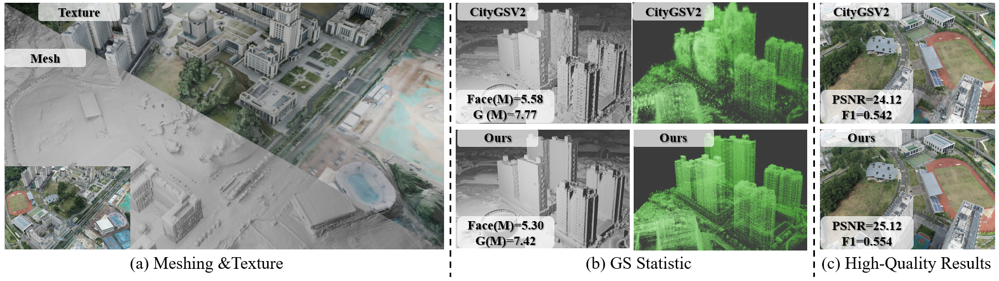

# UrbanQGS: Large-Scale Urban Surface Reconstruction via Analytic Curvature Consistency in Quadratic Gaussian Splatting

> A curvature-driven quadratic Gaussian splatting framework for high-fidelity, compact, and scalable urban surface reconstruction from UAV imagery.



## Overview


**UrbanQGS** is a large-scale urban surface reconstruction framework built on **Quadratic Gaussian Splatting (QGS)**. It targets city-scale UAV photogrammetry scenarios where existing Gaussian-splatting-based reconstruction methods often struggle with:

- incomplete geometry in weak-texture planar regions such as roads, roofs, and façades;
- floating artifacts and redundant primitives around high-frequency structures;
- inefficient Gaussian allocation when scene scale increases;
- global orientation drift during large-scale optimization.

UrbanQGS uses the **analytic Gaussian curvature** of quadratic Gaussian primitives as a view-stable geometric signal. This curvature is used not only as a local regularization cue, but also as a cross-view reliability descriptor and a geometric-complexity prior for adaptive densification.

## Key Features


- **Quadratic Gaussian primitives**  
  Uses second-order surface primitives to better model curved and fine-grained urban geometry.

- **Cross-view curvature-consistency refinement**  
  Constructs reliable pseudo-depth and pseudo-normal supervision by fusing neighboring views with curvature consistency and depth-domain ZNCC confidence.

- **Curvature-aware adaptive representation allocation**  
  Reweights and recalibrates densification gradients using analytic curvature, assigning more primitives to geometrically complex regions while suppressing redundant growth on smooth surfaces.

- **Monocular normal anchoring**  
  Incorporates Metric3D-predicted normal maps as a weak global orientation prior to reduce long-range drift.

- **Block-wise large-scene training**  
  Supports large urban scenes through visibility-aware partitioning and per-block training budgets.

## Experimental Results


UrbanQGS is evaluated on large-scale urban reconstruction benchmarks including **GauU-Scene**, **MatrixCity**, and a custom large-scale UAV dataset.

### GauU-Scene

UrbanQGS achieves state-of-the-art or competitive geometry quality on multiple scenes.

| Scene      | Metric | UrbanQGS |
| ---------- | -----: | -------: |
| UPPER_CAMP |   F1 ↑ |    0.558 |
| LFLS       |   F1 ↑ |    0.501 |
| SMBU       |   F1 ↑ |    0.597 |

Compared with CityGSV2, UrbanQGS improves PSNR by about **1.22 dB on average** on the evaluated GauU-Scene scenes while also improving geometry quality.

### MatrixCity-Aerial

| Method       |    PSNR ↑ | Precision ↑ | Recall ↑ |      F1 ↑ |
| ------------ | --------: | ----------: | -------: | --------: |
| CityGSV2     |     27.23 |       0.441 |    0.752 |     0.556 |
| CityGS-X     |     27.58 |       0.444 |    0.840 |     0.581 |
| MetroGS      |     27.52 |       0.572 |    0.828 |     0.677 |
| **UrbanQGS** | **27.84** |   **0.805** |    0.611 | **0.695** |

### Model Compactness

UrbanQGS reduces redundant Gaussian primitives and mesh complexity while preserving or improving reconstruction quality.

For example, on LFLS:

| Method           | Gaussian Primitives |      F1 ↑ |
| ---------------- | ------------------: | --------: |
| CityGSV2         |               8.08M |     0.466 |
| MetroGS-60K      |              11.33M |     0.494 |
| **UrbanQGS-60K** |           **7.61M** | **0.501** |

On MatrixCity-Aerial, UrbanQGS also substantially reduces extracted mesh size compared with CityGSV2.

## Datasets

The paper evaluates UrbanQGS on:

- **GauU-Scene**: real-world large-scale UAV scenes with LiDAR ground truth;
- **MatrixCity**: synthetic city-scale neural rendering benchmark;
- **LCG custom dataset**: a large-scale oblique UAV urban-residential dataset with more than 11,000 images.

## Data Preparation

1. Place multi-view images under the dataset directory.
2. Run COLMAP to obtain camera poses and sparse SfM points.
3. Generate monocular normal maps using Metric3D.
4. Organize files according to the expected dataset configuration.

Example structure:

```text
data/scene_name/
├── images/
├── sparse/
│   └── 0/
├── normals_metric3d/
├── masks/                 # optional
└── config.yaml
```

## Acknowledgements

This work builds on recent progress in 3D Gaussian Splatting, 2D Gaussian Splatting, Quadratic Gaussian Splatting, large-scale urban reconstruction, COLMAP-based SfM, TSDF fusion, and monocular geometric priors such as Metric3D.

## Citation

If you find this project useful, please cite:

```bibtex
@article{cheng2025urbanqgs,
  title   = {UrbanQGS: Large-Scale Urban Surface Reconstruction via Analytic Curvature Consistency in Quadratic Gaussian Splatting},
  author  = {Cheng, Yuanhang and Yang, Zhe and Lei, Juan and Chu, Jisheng and Li, Wenrui and Xu, Zheng and Chen, Zhuo and Chen, Gang},
  journal = {Preprint},
  year    = {2025}
}
```
